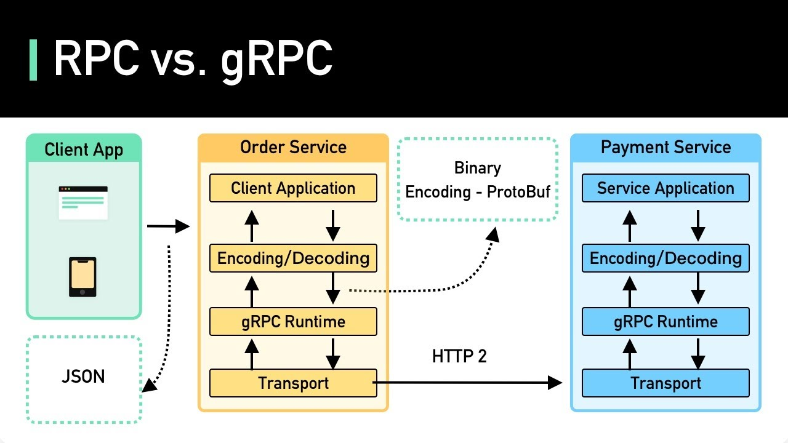

# gRPC

## Introduction

### gRPC

#### What is RPC?

RPC is the abbreviation of remote procedure call.

Simply put, RPC is a mode of invoking remote programs. It allows us to use remote procedures as conveniently as using local calls.

Both client and server will have a stub (pile), which will abstract the underlying processing, so for the client side, it interacts with the stub and does not care where the function it uses is actually written.

Because remote functions can be called like local functions, this mode solves the problem of calling between servers in a distributed system.


This picture briefly describes the entire RPC process:

1. Client's application is the call of this procedure, which will call the method in client stub.

2. Client stub is a proxy object that wraps the calling process. In fact, it does not own the Method that client application wants to call, so it will make RPC calls.

3. Client run-time library is a toolkit for implementing RPC calls.

4. Finally, we will implement data transmission through the underlying network.

#### What is gRPC?

gRPC is an open source RPC system initiated by Google. The goal is to make it easier for us to create distributed applications and services.


gRPC is based on the HTTP/2 protocol and uses `protocol buffers` as the interface description language (IDL).
The process of using gRPC is as follows:

1. Define the desired data types and methods in a .proto protocol buffers file.

2. Compile with gRPC's CLI commands.

3. After compiling, stub's interface and some accessors will be generated according to this file.

4. By implementing these interfaces and accessors, we can easily read and write structured data in various data streams in various languages.



gRPC client and server can run and communicate in various environments, and can freely choose a language that supports gRPC for development. Taking the above example as an example, we can develop gRPC Server in C++ on the server side, and use Ruby and Android Java to develop on the client side at the same time.

In addition, because it has strict API specifications, it is also very suitable for teams to use.

In the middle, because I just want to call the remote procedure, RPC actually often uses binary transmission with higher transmission efficiency, and there will be serialization and deserialization in the process.

#### Protocol Buffers

The default IDL of gRPC is protocol buffers. Although other data formats such as JSON can also be used, this IDL is of course the most recommended. It is a serialized structured data.

Protocol buffers are Google's language-native, platform-native extensibility mechanism. Used to serialize structured data. Kind of like XML, but smaller, faster and simpler.

Protocol buffers are suitable for data transmission scenarios that require high performance and response speed. Because it is transmitted in binary, the data itself is not readable. We will need to get real readable data after deserialization.

#### Four life cycles of gRPC

Thanks to its HTTP2-based technology, gRPC supports four lifecycles, which can be selected for different usage scenarios:

1. Unary (One-to-One): A request to a response.

2. Client-side streaming (Many-to-One): The client sends many requests (streaming), and the server only returns one response after the end.

3. Server-side streaming (One-to-Many): Client only uploads one request, but server returns a bunch of responses (streaming).

4.
 Bidirectional streaming (Many-to-Many): Both client and server interact in the form of streaming.

### HTTP/2 Streaming


All communication in HTTP/2 will be done on a TCP connection, which can carry any number of bidirectional byte streams. Each byte stream will have a unique identifier and optional priority information.

In this bidirectional byte stream, multiple messages can be carried, and each message is an HTTP message, such as request or response.

In these messages, a series of frames will be included. Frame is the smallest communication unit, which contains specific types of data, HTTP headers, payloads, and so on.

In a TCP communication, since there can be multiple streams at the same time, the frame will also have stream identifiers. Frames belonging to different streams can be transmitted interactively, and then reassembled according to these identifiers.

Based on such a new transmission structure, the function of reducing TCP connections and enabling Streaming has been achieved on HTTP/2. At the same time, because these transmissions use byte streams, gRPC development also requires encoding and decoding when sending or receiving requests.

## How to run the app

### Deploy MongoDB

```bash
kubectl apply -f ./k8s/mongodb
```

### Build Proto Files

```bash
protoc -I=./proto --go-grpc_out=. ./proto/*.proto
```

### Build Services

```bash
go clean --cache && go test -v -cover microservices/...
go build -o authentication/authsvc authentication/main.go
go build -o api/apisvc api/main.go
```

### Build Image

```bash
docker build -t microservices:v1 .
docker inspect microservices:v1
```

### Deploy Services

```bash
kubectl apply -f ./k8s/services
```

### Visualize Logs

```bash
minikube dashboard
```

##### Tags: `gRPC` `MongoDB` `Microservice` `Kubernetes`